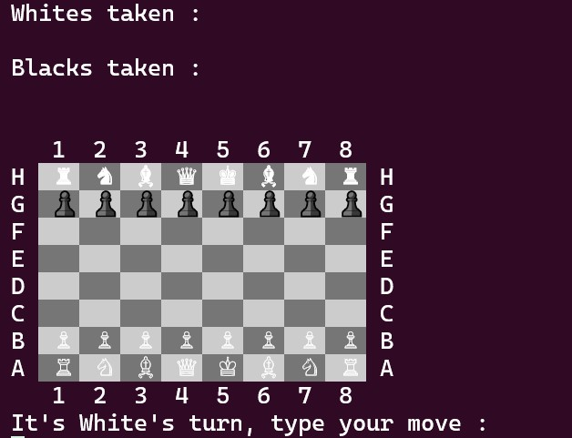

# Chess

This is a ruby project for [TheOdinProject](https://www.theodinproject.com/) curriculum.

It is the famous game, chess.

## Game rules
It was created based on rules found on [Illustrated rules of chess](http://www.chessvariants.org/d.chess/chess.html)

## Third party resources
Welcome screen text transformation to ASCI chars was made by tool found on [this site](http://patorjk.com/software/taag/#p=display&f=Graffiti&t=Type%20Something%20)

Enjoy!